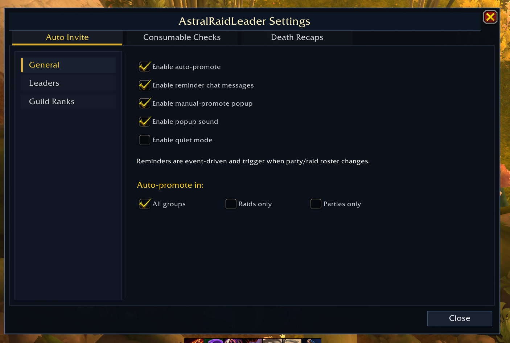

# AstralRaidLeader

A World of Warcraft addon that keeps your raid leader hand-offs consistent.

## Screenshot



In-game settings window for configuring auto-promote, reminder behavior, popup notifications, and preferred leaders.

## Features

- **Preferred-leader list** – maintain an ordered list of characters who should hold Raid Leader.
- **Auto-promote** – whenever a roster update fires and you are the group/raid leader, the addon automatically promotes the highest-priority preferred leader who is currently in the group.
- **Guild rank priority (index-safe)** – define an ordered list of guild ranks; when no preferred leader is present the addon automatically promotes the highest-priority guild rank member in the group, and stores both rank name and rank index so duplicate rank names remain unambiguous.
- **Manual-promotion popup** – when auto-promote is off and a preferred leader is present, a configurable popup appears with a one-click **Promote** button. It can reappear after **Not Now** on later roster/instance changes, and defers while in combat.
- **Reminder system** – if no preferred leader is present in the group, an event-driven in-chat reminder fires on member-join/instance-change style triggers.
- **List reordering** – move preferred leaders up or down in priority using slash commands or the **Move Up** / **Move Down** buttons in the settings window; no need to remove and re-add entries.
- **Group-type filters (multi-select)** – independently toggle auto-promote and death-recap capture for raids, parties, guild raids, and guild parties. You can enable any combination.
- **Consumable audit** – when a ready check is initiated, the addon scans every queryable group member's active buffs and prints a report of who is missing tracked consumable categories (e.g. Flask, Food). Members outside your current instance/phase are skipped to avoid false positives. Consumable categories are fully configurable via `/arl consumable add`. The audit can be toggled on or off without affecting any other feature.
- **Raid group layouts** – import Viserio-style encounter notes, edit layouts in a visual draft planner, and apply subgroup assignments to your current raid. Use the Raid Groups dropdown to select a layout (or choose **None (disabled)**). Saved layouts now support sparse subgroup assignments (for example intentionally placing players in group 8 while leaving earlier groups partially empty). Optional settings let you auto-apply on joins and invite missing listed players on apply.
- **Raid layout difficulty guard** – imported layouts are keyed by encounter + difficulty and only apply when the current raid difficulty matches the layout's saved difficulty.
- **Death recap** – records wipe deaths and displays them in a recap window (`/arl deaths`). In current Midnight-compatible builds, death data is sourced from the built-in `C_DamageMeter` combat session API.
- **Quiet mode** – suppress all addon chat output so auto-promotion happens silently in the background.
- **Persistent settings** – your list and preferences are saved between sessions via `SavedVariables`.

## Development file layout

The options UI is now modular. `AstralRaidLeader_Options.lua` is the bootstrap/wiring layer, and panel builders live in
separate modules:

- `AstralRaidLeader_Options_General.lua`
- `AstralRaidLeader_Options_Leaders.lua`
- `AstralRaidLeader_Options_GuildRanks.lua`
- `AstralRaidLeader_Options_Consumables.lua`
- `AstralRaidLeader_Options_DeathsPanel.lua`
- `AstralRaidLeader_Options_RaidGroupsLayouts.lua`
- `AstralRaidLeader_Options_RaidGroupsImport.lua`
- `AstralRaidLeader_Options_RaidGroupsSettings.lua`
- `AstralRaidLeader_Options_RaidGroupsLogic.lua`

`AstralRaidLeader.toc` loads these module files before `AstralRaidLeader_Options.lua` so builder/logic functions are
available during options initialization.

## Installation

1. Download the latest release.
2. Extract the `AstralRaidLeader` folder into your WoW addons directory:
   ```
   World of Warcraft/_retail_/Interface/AddOns/AstralRaidLeader/
   ```
3. Restart WoW (or reload your UI with `/reload`).
4. The addon is enabled by default for all characters.

## Usage

All commands use the `/arl` (or `/astralraidleader`) prefix.

| Command | Description |
|---|---|
| `/arl add <name>` | Add a character to the preferred leaders list |
| `/arl` | Open the in-game settings window |
| `/arl remove <name>` | Remove a character from the list |
| `/arl move <name> <pos>` | Move a character to a specific position in the list |
| `/arl list` | Show the preferred leaders list (highest priority first) |
| `/arl clear` | Clear the entire list |
| `/arl promote` | Manually promote the highest-priority preferred leader currently in the group |
| `/arl auto [on\|off]` | Enable or disable automatic promotion on roster changes |
| `/arl reminder [on\|off]` | Enable or disable event-driven reminders |
| `/arl notify [on\|off]` | Enable or disable the manual-promote popup when auto-promote is off |
| `/arl notifysound [on\|off]` | Enable or disable sound for the manual-promote popup |
| `/arl quiet [on\|off]` | Suppress all addon chat output (auto-promote still works silently) |
| `/arl grouptype [raid\|party\|guild_raid\|guild_party] [on\|off]` | Toggle auto-promote for an individual group type (omit on/off to toggle) |
| `/arl consumable list` | List all tracked consumable categories and their spell IDs |
| `/arl consumable add <label> <spellId>` | Add a spell ID to a consumable category (creates the category if needed) |
| `/arl consumable remove <label> <spellId>` | Remove a spell ID from a consumable category |
| `/arl consumable delete <label>` | Delete an entire consumable category |
| `/arl consumable clear` | Remove all tracked consumable categories |
| `/arl consumable audit` | Run the consumable audit immediately |
| `/arl consumableaudit [on\|off]` | Enable or disable the automatic consumable audit on ready check |
| `/arl rankpriority [on\|off]` | Enable or disable guild rank priority fallback |
| `/arl addrank <rank>` | Add a guild rank to the rank priority list |
| `/arl removerank <rank>` | Remove a guild rank from the rank priority list |
| `/arl ranklist` | Show the guild rank priority list (highest priority first) |
| `/arl clearranks` | Clear the entire guild rank priority list |
| `/arl moverank <rank> <pos>` | Move a guild rank to a specific position in the list |
| `/arl raidgroups status` | Show the active imported raid-group layout |
| `/arl raidgroups list` | List all saved imported raid-group layouts |
| `/arl raidgroup <subcommand>` | Alias for `/arl raidgroups <subcommand>` |
| `/arl raidgroups select <id\|name>` | Select a saved raid-group layout |
| `/arl raidgroups apply [id\|name]` | Apply the active or named raid-group layout to the current raid |
| `/arl raidgroups delete <id\|name>` | Delete one saved raid-group layout |
| `/arl raidgroups clear` | Delete all saved raid-group layouts |
| `/arl deaths` or `/arl wipe` | Open the last wipe death recap window |
| `/arl deathtracking [on\|off]` | Enable or disable death tracking during encounters |
| `/arl deathgrouptype [raid\|party\|guild_raid\|guild_party] [on\|off]` | Toggle death recap capture for an individual group type (omit on/off to toggle) |
| `/arl settings` | Open the in-game settings window |
| `/arl options` / `/arl config` | Alias for opening the in-game settings window |
| `/arl help` | Show all available commands |

### Quick-start example

```
/arl add Thrall
/arl add Jaina
/arl list
```

The addon will now automatically pass Raid Leader to **Thrall** whenever he joins your group while you are the leader. If Thrall is absent, it will try **Jaina** next. If neither is present, reminders are event-driven (for example on roster or instance context changes).

### Guild rank priority quick-start

```
/arl rankpriority on
/arl addrank Officer
/arl addrank Raider
/arl ranklist
```

If no character from the preferred leaders list is in the group, the addon will now automatically promote the first **Officer** it finds; if no Officers are present it will try **Raiders**. This fallback integrates seamlessly with auto-promote and the manual-promote popup.

### Death recap

Use `/arl deaths` to open the last wipe recap window.

The recap records who died and when during a failed encounter attempt. Death source/mechanic data is pulled from the built-in `C_DamageMeter` combat session API when available. When recap payloads include a spell ID but a placeholder mechanic label (for example `...`), the UI resolves and displays the spell name.

### Raid group layouts

Open the settings window and use the `Raid Groups` tab, which has three sub-tabs:
- `Layouts`: visual draft planner for editing encounter ID, difficulty, name, and per-group player assignments.
- `Import`: paste one or more Viserio-style encounter blocks such as `EncounterID:3176;Difficulty:Mythic;Name:Averzian` followed by an `invitelist:` line, then click `Import Note`.
- `Settings`: behavior toggles for auto-apply and reporting.

On the `Layouts` sub-tab:
- Use `Load Saved` / `Reset To Saved` to synchronize the draft with the selected saved layout.
- Use `Empty` or `From Raid` to start a new draft.
- Use `Reorganize` to compact the current draft into sequential 5-player groups while preserving current top-to-bottom order.
- Use `Save New` or `Overwrite` to persist the current draft.

Saved layouts now persist explicit subgroup assignments (`groups[1..8]`) and still maintain `invitelist` for backward compatibility.
This means sparse layouts (with intentional gaps) survive save/load and apply.

Applying a saved layout places explicitly assigned players into their saved groups. Current raiders not listed in the layout are packed into groups 8, 7, 6, and 5 as space allows.

Saved layouts only apply when the current raid difficulty matches the layout's imported difficulty.

In the `Settings` sub-tab, you can configure:
- auto-applying the selected layout when a new member joins
- showing missing-player names in apply output
- inviting listed players not already in raid when you apply

The invite-on-apply option is disabled by default. Auto-apply-on-join re-runs subgroup placement only and does not repeatedly send invites.

## How it works

1. On every `GROUP_ROSTER_UPDATE` event, if the local player is the group/raid leader, the addon walks the preferred-leaders list from top to bottom.
2. The first name found in the current group is promoted via `PromoteToLeader()`.
3. If no match is found **and** guild rank priority is enabled, the addon walks the guild rank priority list and promotes the first group member whose guild rank matches the highest-priority entry. Matching prefers rank index (when known) and falls back to rank name for legacy entries.
4. If still no match is found **and** the reminder is enabled, an event-driven chat reminder can fire on relevant roster/instance triggers.
5. Popup prompts are subject to their own cooldown after **Not Now** and can bypass cooldown on specific high-signal triggers like member joins.
6. When a `READY_CHECK` event fires, the addon scans each queryable group member's active buffs. Members outside your current instance/phase are skipped. For every tracked consumable category, it checks whether the member has at least one of the listed spell IDs as an active buff. Anyone missing one or more categories is included in a chat report.

### Setting up consumable tracking

Built-in categories include **Flasks** and **Food** (`Well Fed` name match). You can add your own categories or extend existing ones with spell IDs relevant to your current tier, for example:

```
/arl consumable add Flask 431972
/arl consumable add Flask 432021
/arl consumable add Food  457302
```

You can look up spell IDs on [Wowhead](https://www.wowhead.com) by searching for the buff name and noting the ID in the URL. Run `/arl consumable list` to review what is currently tracked.

## Saved variables

Settings are stored in `AstralRaidLeaderDB` (per-account). The file is located at:
```
WTF/Account/<account>/SavedVariables/AstralRaidLeader.lua
```

## Compatibility

Targets **WoW Retail** (Interface `120001`, Midnight). The addon uses standard group/raid APIs plus modern Retail APIs for consumable auditing and death recap.

## Release workflow

This repository uses GitHub Actions with `BigWigsMods/packager@v2` to publish tagged releases to CurseForge.

### How to release

1. Merge your changes into `main` (or `master`).
2. Create an annotated tag like `v1.3.1` or `v1.3.2-beta.1`.
3. Push the tag.
4. GitHub Actions runs [.github/workflows/release.yml](.github/workflows/release.yml) and publishes the package.

The TOC uses `## Version: @project-version@`, so the packaged addon version follows the git tag automatically.